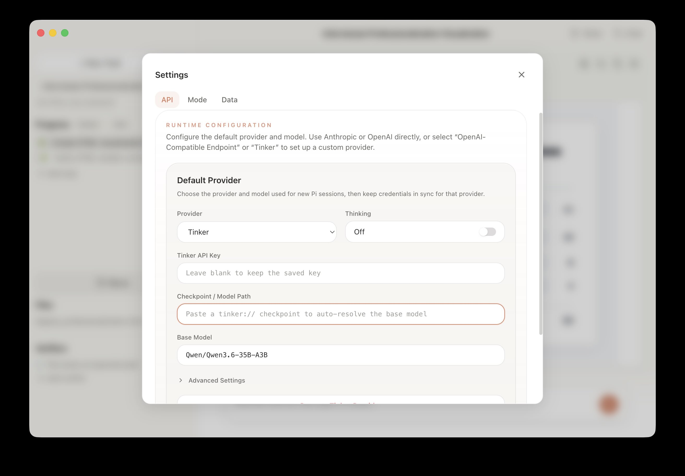
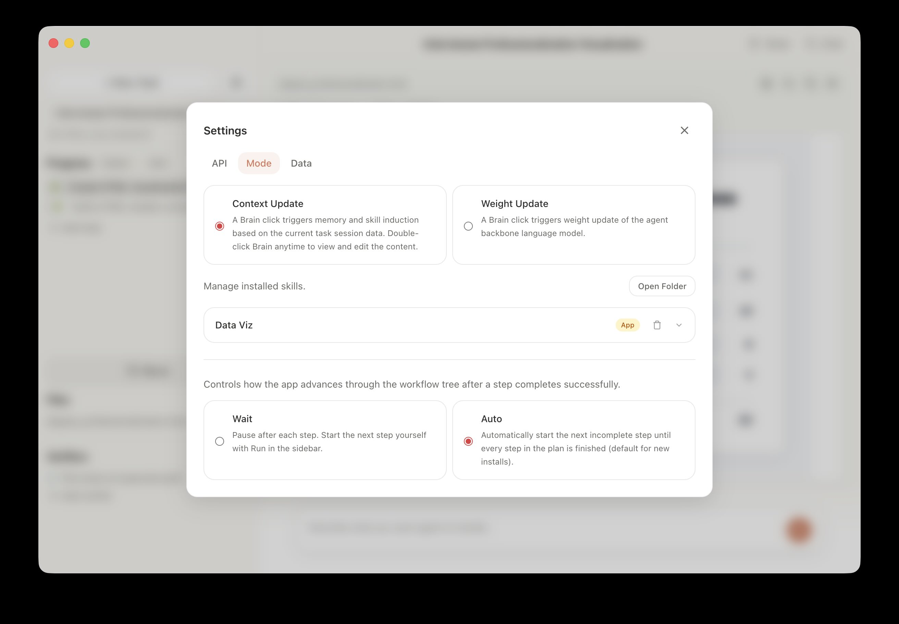

<div align="center">

# Efficient Test-Time Adaptation in Human-Agent Interaction

</div>

## 🚀 Quick Start: Human-Agent Interaction Interface

Install [Bun](https://bun.sh/)
```bash
curl -fsSL https://bun.sh/install | bash
```

Clone the repository and install dependencies
```bash
git clone https://github.com/zorazrw/tahi-agent.git
cd tahi-agent
bun install
bun run dev
```

It will then launch the interface for human-agent interaction (left). After setting up the provider, model, and API (right), you can start a new task by typing in an instruction in the chat box, or selecting a task from the dropdown menu (for reproducing our experiments).

Find more detailed instructions in using the interface [here](https://docs.google.com/presentation/d/16esWyWrb1ZEjY44vKpKZ7I94gPMKbMyMvbMFHvuIKdM/edit?usp=sharing).
All interface implementations are under the `src/` directory.

<div align="center">
  <table>
    <tr>
      <td width="50%" valign="middle" align="center">
        <video src="docs/assets/step3-iteration-preview.mp4" width="100%" autoplay muted loop playsinline controls>
          <a href="docs/assets/step3-iteration.MP4">Human-agent interaction interface</a>
        </video>
      </td>
      <td width="50%" valign="middle" align="center">
        
      </td>
    </tr>
  </table>
</div>

## 📈 Test-Time Agent Adaptation

Simply click "setting" icon, under the "Mode" tab, select "Context Update" or "Weight Update" to enable corresponding adaptation (left).
Particularly under "Context Update" mode, you can inspect, edit, and add new context items to the agent memory and skills (right).

Whenever you want to use the current task session to update the agent, single click the "Brain" icon on the top right corner of the interface.

<div align="center">
  <table>
    <tr>
      <td width="50%" valign="middle" align="center">
        
      </td>
      <td width="50%" valign="middle" align="center">
        <video src="docs/assets/brain-edit.mov" width="100%" autoplay muted loop playsinline controls>
          <a href="docs/assets/brain-edit.mov">Inspect, edit, and add context items in Context Update mode</a>
        </video>
      </td>
    </tr>
  </table>
</div>

If you want to closely inspect, reproduce, and extend our experiments, you can find the context and weight adaptation scripts in `scripts/` directory.

## Citation
```bibtex
@article{wang2026efficient,
  title={Efficient Test-Time Adaptation in Human-Agent Interaction},
  author={...},
  journal={arXiv preprint arXiv:2609.xxxxx},
  year={2026}
}
```
