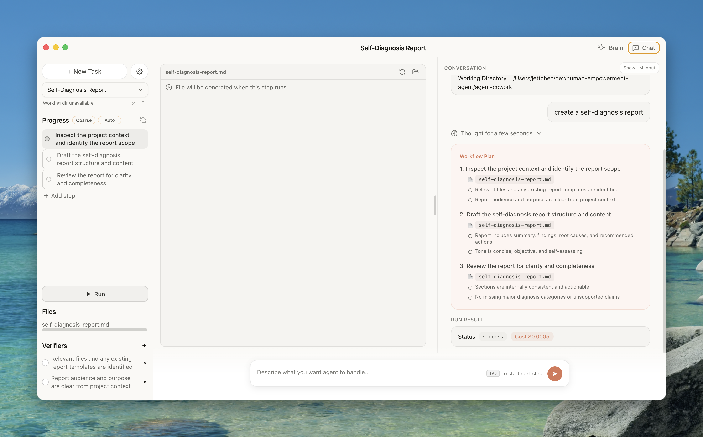
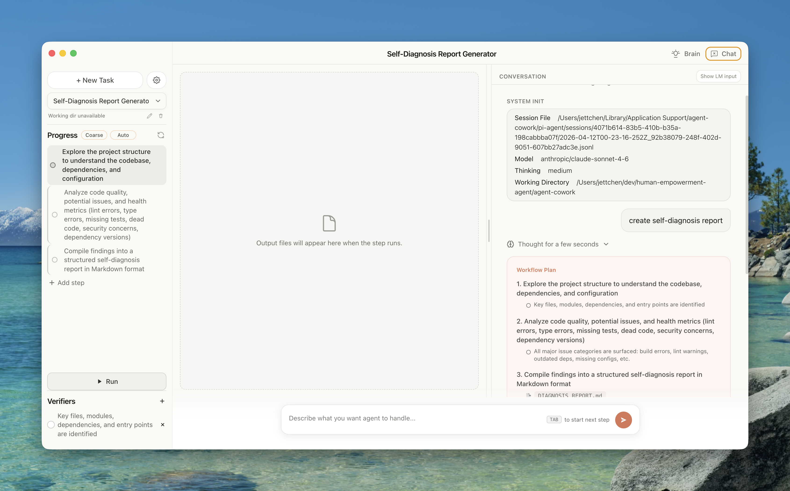
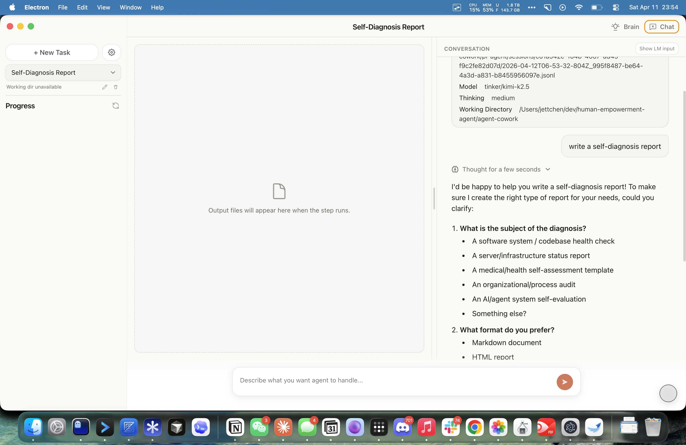

# Custom Provider Support

Agent Cowork supports multiple LLM providers through the Pi runtime. You can configure which provider and model to use from **Settings > Runtime Configuration** in the app.

## Supported Providers

### Anthropic

Uses your local Claude Code credentials.

- **Authentication**: API key or OAuth. If you have Claude Code installed and authenticated, the app picks up your existing credentials automatically via environment.
- **Models**: Claude Haiku 4.5, Claude Sonnet 4.6, and Claude Opus 4.6. Defaults to Claude Sonnet 4.6.
- **Setup**: Select "Anthropic" in the provider dropdown. Enter an API key if one isn't detected from your environment.



### OpenAI

Direct integration with OpenAI's API.

- **Authentication**: API key (paste your `sk-...` key in the settings panel).
- **Models**: GPT-4o, o3, and other models from the Pi model registry.
- **Setup**: Select "OpenAI" in the provider dropdown and enter your API key.

### OpenAI-Compatible Endpoint

Connect any provider that exposes an OpenAI-compatible API (e.g. vLLM, Ollama, Together, Azure OpenAI, or your own server).

- **Base URL**: The endpoint root, e.g. `http://localhost:8000/v1` or `https://api.together.xyz/v1`.
- **Model slug**: The model identifier your server expects (e.g. `meta-llama/Llama-3-70b-chat-hf`).
- **API format**: Choose between `OpenAI Completions` (chat completions) and `OpenAI Responses` (responses API) depending on what your server supports.
- **API key** (optional): Required if your endpoint needs authentication.

**Setup steps:**

1. Open Settings and select "OpenAI-Compatible Endpoint" as the provider.
2. Enter the Base URL and Model slug.
3. Pick the API format that matches your server.
4. (Optional) Enter an API key.
5. Save.

The configuration is stored in `~/.pi-agent/models.json` under `providers["openai-compatible"]`.



### Tinker

Tinker routes requests through a local Python bridge to a fine-tuned or custom model. This is useful for research workflows where you want to run your own model weights.

- **Base model**: The foundation model your checkpoint is built on (e.g. `moonshotai/Kimi-K2.5`). This tells the bridge which tokenizer and chat template to use.
- **Checkpoint / Model path** (optional): A `tinker://` path or local checkpoint directory. When a `tinker://` path is provided, the app auto-resolves the base model.
- **Base URL** (optional): Override the inference server URL if you're running the bridge separately.
- **API key** (optional): If your inference server requires authentication.
- **Thinking toggle**: On/off switch that controls whether the bridge picks a thinking-enabled or `disable_thinking` renderer for the base model.
- **Advanced settings**: Renderer name, context window, and max output tokens.

**Setup steps:**

1. Install dependencies (includes the Tinker bridge via `postinstall`):
   ```bash
   bun install
   ```
   Or sync only the bridge: `bun run sync:tinker-bridge`
2. Open Settings and select "Tinker" as the provider.
3. Enter the base model (required) and optionally a checkpoint path.
4. Adjust advanced settings if needed.
5. Save. The app starts the Python bridge process automatically.

The configuration is stored in `~/.pi-agent/tinker-provider.json`.



## Configuration Files

All provider configuration is stored under `~/.pi-agent/`:

| File | Purpose |
|------|---------|
| `settings.json` | Default provider, model, and thinking level |
| `auth.json` | API keys and OAuth tokens for all providers |
| `models.json` | OpenAI-compatible endpoint configuration |
| `tinker-provider.json` | Tinker model and bridge configuration |

## Adding a New Provider Programmatically

If you want to configure providers without the UI:

1. **Standard providers** (Anthropic, OpenAI): Set the API key in `~/.pi-agent/auth.json` or via the corresponding environment variable (e.g. `ANTHROPIC_API_KEY`, `OPENAI_API_KEY`).

2. **OpenAI-compatible**: Add an entry to `~/.pi-agent/models.json`:
   ```json
   {
     "providers": {
       "openai-compatible": {
         "baseUrl": "http://localhost:8000/v1",
         "api": "openai-completions",
         "models": [{ "id": "my-model" }]
       }
     }
   }
   ```

3. **Set the default**: Update `~/.pi-agent/settings.json`:
   ```json
   {
     "defaultProvider": "openai-compatible",
     "defaultModel": "my-model"
   }
   ```

---

## Trajectory Format & Export Guide

Session history (trajectories) is stored as an ordered array of `StreamMessage` objects in SQLite. Each message is a JSON blob with a `type` discriminator. There are two format generations — **Pi** (current) and **Legacy** (read-only, from older Claude-backed sessions).

### Pi format (current)

All new sessions use the Pi engine. Messages flow: `system_init` -> (`user_prompt` -> `assistant` -> `tool_result`)\* -> `run_result`.

#### `system_init`

Session metadata, emitted once at the start.

```jsonc
{
  "type": "system_init",
  "engine": "pi",
  "sessionFile": "session-abc123.json",
  "provider": "anthropic",       // or "tinker", "openai", "openai-compatible"
  "model": "claude-sonnet-4-20250514",
  "cwd": "/Users/you/project",
  "thinkingLevel": "medium"      // "off" | "minimal" | "low" | "medium" | "high" | "xhigh"
}
```

#### `user_prompt`

```jsonc
{ "type": "user_prompt", "prompt": "create a self-diagnosis report" }
```

#### `assistant`

Contains an ordered array of content blocks — text, thinking, and tool calls.

```jsonc
{
  "type": "assistant",
  "engine": "pi",
  "id": "uuid",
  "blocks": [
    { "type": "thinking", "thinking": "I should first look at..." },
    { "type": "text", "text": "Here is my plan..." },
    { "type": "tool_use", "id": "call_1", "name": "read", "input": { "path": "src/main.ts" } }
  ],
  "provider": "anthropic",
  "model": "claude-sonnet-4-20250514",
  "stopReason": "toolUse",       // "stop" | "toolUse" | "length" | "error" | "aborted"
  "timestamp": 1712872800000
}
```

#### `tool_result`

One per tool call, matched by `toolUseId`.

```jsonc
{
  "type": "tool_result",
  "engine": "pi",
  "toolUseId": "call_1",
  "toolName": "read",
  "content": "file contents here...",
  "isError": false,
  "timestamp": 1712872801000
}
```

#### `run_result`

Emitted once at the end of a run with aggregate usage/cost.

```jsonc
{
  "type": "run_result",
  "engine": "pi",
  "status": "success",           // "success" | "error" | "aborted"
  "usage": {
    "input": 12500,
    "output": 3200,
    "cacheRead": 8000,
    "cacheWrite": 4500,
    "totalTokens": 15700,
    "cost": { "input": 0.012, "output": 0.048, "total": 0.06 }
  },
  "timestamp": 1712872900000
}
```

#### `llm_debug` (optional)

Raw LLM request/response pairs, useful for debugging provider behavior. Only present when debug logging is enabled.

```jsonc
{
  "type": "llm_debug",
  "engine": "pi",
  "provider": "tinker",
  "model": "kimi-k2.5",
  "request": { /* BridgeRequest or provider-specific payload */ },
  "response": { /* raw provider response */ },
  "title": "Tinker Request/Response",
  "timestamp": 1712872805000
}
```

### Legacy format (read-only)

Older sessions created before the Pi migration use `engine: "legacy-claude"`. These sessions are **read-only** — they cannot be continued, only viewed. The key structural differences from Pi format:

| Aspect | Pi | Legacy |
|---|---|---|
| Assistant content | Top-level `blocks` array | Nested at `message.content` |
| Tool results | Separate `tool_result` messages | Embedded in `user` messages as `tool_result` blocks |
| Init message | `system_init` with `engine: "pi"` | `system` with `subtype: "init"` |
| Run completion | `run_result` with structured usage | `result` with `duration_ms`, `total_cost_usd` |
| Task grouping | Flat sequence | `parent_tool_use_id` field on assistant/user messages |

#### Legacy `assistant`

```jsonc
{
  "type": "assistant",
  "uuid": "msg_abc123",
  "parent_tool_use_id": null,
  "message": {
    "role": "assistant",
    "content": [
      { "type": "thinking", "thinking": "...", "thinkingSignature": "..." },
      { "type": "text", "text": "..." },
      { "type": "tool_use", "id": "call_1", "name": "Read", "input": { "path": "..." } }
    ]
  }
}
```

#### Legacy `user` (tool results)

```jsonc
{
  "type": "user",
  "uuid": "msg_def456",
  "parent_tool_use_id": "call_1",
  "message": {
    "role": "user",
    "content": [
      { "type": "tool_result", "tool_use_id": "call_1", "content": "file contents..." }
    ]
  }
}
```

### Normalizing legacy to Pi format

If you're writing trajectory processing code, normalize legacy messages on load so all downstream code handles a single format. The content block types (`text`, `thinking`, `tool_use`) are already structurally identical between the two formats — the difference is only in the message envelope.

```typescript
import type {
  StreamMessage,
  PiAssistantMessage,
  PiToolResultMessage,
  PiSystemInitMessage,
  PiRunResultMessage,
  LegacyAssistantMessage,
  LegacyUserMessage,
  LegacySystemMessage,
  LegacyResultMessage,
} from "../lib/runtime-types";

/** Normalize a legacy message into the Pi format. Non-legacy messages pass through unchanged. */
function normalizeMessage(msg: StreamMessage): StreamMessage | StreamMessage[] {
  // Legacy assistant -> Pi assistant
  if (msg.type === "assistant" && "message" in msg) {
    const legacy = msg as LegacyAssistantMessage;
    return {
      type: "assistant",
      engine: "pi",
      id: legacy.uuid ?? crypto.randomUUID(),
      blocks: legacy.message.content,  // block types are already identical
    } satisfies PiAssistantMessage;
  }

  // Legacy user (tool results) -> Pi tool_result messages (one per block)
  if (msg.type === "user" && "message" in msg) {
    const legacy = msg as LegacyUserMessage;
    return legacy.message.content.map((block) => ({
      type: "tool_result",
      engine: "pi",
      toolUseId: block.tool_use_id,
      toolName: "tool",
      content: typeof block.content === "string"
        ? block.content
        : block.content.map((c) => c.text).join("\n"),
      isError: block.is_error ?? false,
    } satisfies PiToolResultMessage));
  }

  // Legacy system init -> Pi system_init
  if (msg.type === "system" && (msg as LegacySystemMessage).subtype === "init") {
    const legacy = msg as LegacySystemMessage;
    return {
      type: "system_init",
      engine: "pi",
      provider: undefined,
      model: legacy.model,
      cwd: legacy.cwd,
    } satisfies PiSystemInitMessage;
  }

  // Legacy result -> Pi run_result
  if (msg.type === "result") {
    const legacy = msg as LegacyResultMessage;
    return {
      type: "run_result",
      engine: "pi",
      status: legacy.subtype === "success" ? "success" : "error",
      error: legacy.error,
      usage: {
        input: legacy.usage?.input_tokens,
        output: legacy.usage?.output_tokens,
        cost: legacy.total_cost_usd != null
          ? { total: legacy.total_cost_usd }
          : undefined,
      },
    } satisfies PiRunResultMessage;
  }

  // Pi messages and other types pass through
  return msg;
}

/** Normalize an entire session history. */
export function normalizeHistory(messages: StreamMessage[]): StreamMessage[] {
  return messages.flatMap((msg) => {
    const result = normalizeMessage(msg);
    return Array.isArray(result) ? result : [result];
  });
}
```

After normalization, all messages follow the Pi schema. You can then process trajectories with a single set of type guards:

```typescript
for (const msg of normalizeHistory(rawMessages)) {
  switch (msg.type) {
    case "system_init":  /* ... */ break;
    case "user_prompt":  /* ... */ break;
    case "assistant":    /* msg.blocks */ break;
    case "tool_result":  /* msg.toolUseId, msg.content */ break;
    case "run_result":   /* msg.status, msg.usage */ break;
  }
}
```

### Provider-specific notes

- **Anthropic / OpenAI**: The `assistant.blocks` and `tool_result` messages map directly to the provider's native chat format. No special handling needed.
- **Tinker**: The `llm_debug` messages contain the full `BridgeRequest` (with `provider`, `model`, `options.reasoning`, and `context`) and the `BridgeResult` (with `renderer_name`, `parse_success`, `message`, and `usage`). These are useful for debugging renderer selection and token-level analysis.
- **OpenAI-Compatible**: Behaves like OpenAI. The `system_init.provider` will be `"openai-compatible"` and the model will be whatever slug you configured.
