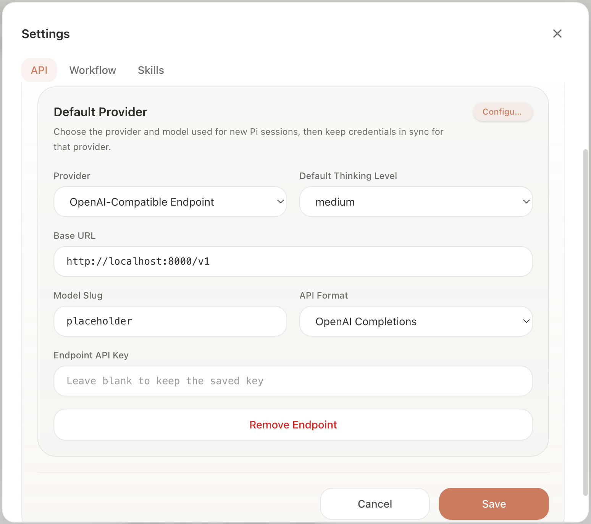

# Data Export and Agent Update

## Data Export

`tasks/export_task_sessions.py` is a standalone Python 3 script (stdlib only) to export task sessions from the Agent Cowork SQLite database to JSON.

**Usage:**
```bash
python scripts/tasks/export_task_sessions.py -o out.json

# Single session
python scripts/tasks/export_task_sessions.py --session-id <uuid> -o session.json

# Default export is weight-style for training compatibility.
python scripts/tasks/export_task_sessions.py -o out_weight.json
```

**Exported Data Structure:**

```json
{
  "uuid": "<session id>",
  "name": "<title>",
  "trajectory": [
    {
      "actor": "user | agent",
      "action": "<action string>",
      "message": "<optional decoded message text>",
      "tool_result": "<optional merged tool result text>",
      "environment": {
        "workflow": "<nested workflow tree with verifier statuses>",
        "file": "<output file snapshots>",
        "memory": "<memory file map>",
        "skill": "<skill file map>"
      }
    }
  ]
}
```


## Session file snapshots → GIF

`tools/session_file_versions_to_gif.py` builds animated GIFs from **`.html` / `.png`** snapshot histories in a session (skips `.py` and other text). Discovers visual files automatically; `-o` is the output **`.gif`** path. HTML uses Playwright; PNG uses embedded/base64 bytes when present.

**Dependencies:** `pip install playwright`, `playwright install chromium`, and `ffmpeg` on your PATH.

```bash
python scripts/tools/session_file_versions_to_gif.py \
  -j sessions/export.json -s <uuid> -o chart.gif

# One GIF per visual artifact (e.g. report.html → ./report.gif)
python scripts/tools/session_file_versions_to_gif.py -j sessions/export.json -s <uuid>
```

## Context-Based Update

`induce.py` extracts memories and skills from session JSON (e.g. ``memories/{task-name}.md`` and ``skills/{task-name}.md``). The Electron app runs it via the brain icon; you can also invoke it from the CLI.

**Usage:**

```bash
python scripts/induce.py --data_path out.json --output_dir "."
```

## Weight-Based Update

DPO, OPD, and REINFORCE now share the weight-format training stack under
`scripts/weight/`. Export sessions once, then either run the online server or
invoke a specific trainer module.

```bash
python3 scripts/tasks/export_task_sessions.py -o scripts/out_weight.json

python3 -m scripts.weight.train.run_dpo \
  --train-path scripts/out_weight.json \
  --model-name Qwen/Qwen3-8B \
  --renderer-name qwen3 \
  --log-path logs/dpo

python3 -m scripts.weight.train.run_opd \
  --train-path scripts/out_weight.json \
  --model-name Qwen/Qwen3-8B \
  --renderer-name qwen3 \
  --log-path logs/opd

python3 -m scripts.weight.train.run_reinforce \
  --train-path scripts/out_weight.json \
  --model-name Qwen/Qwen3-8B \
  --renderer-name qwen3 \
  --log-path logs/reinforce
```

## Online RL Server

`server.py` runs a small **FastAPI** proxy in front of the Tinker OpenAI-compatible API. It accepts chat completions (streaming or not), enqueues exported **sessions** for training, and periodically runs **DPO**, **OPD**, or **REINFORCE** updates depending on `mode` in the YAML.

**Prerequisites**

- Set `TINKER_API_KEY` in the environment (or `.env` under the root directory).

**Configuration**

Edit `config.yaml` (or any YAML with the same keys). Important fields:

- `mode`: `dpo` | `opd` | `reinforce` — which trainer runs when enough sessions are queued.
- `update_every_n_sessions`: enqueue this many sessions before triggering a training job.
- `proxy_host` / `proxy_port`: where the HTTP server listens (default `localhost:8000`).

**Run**

From the root directory:

```bash
python3 scripts/server.py --config scripts/config.yaml
```

**Rolling training window** (latest K submitted sessions per round, separate from the default server):

```bash
python3 scripts/server_window.py --config scripts/config_window.yaml
```

Uses `training_window_sessions` and a separate port so it does not overwrite the default experiment state. By default, each server run gets its own timestamped experiment directory under `log_root`, and `state_path` is stored there unless you explicitly pin `experiment_name` or `state_path`.

`GET /healthz` returns `{"ok": true}` when the process is up.

**Frontend**

Point your provider at this proxy (base URL and port from `proxy_host` / `proxy_port`). Example layout:



**Training**

Training is triggered from the frontend with the **Train on this session** button in the lower-left corner. The frontend posts the current weight-format session to the server, and the server builds the dataset required by the configured training mode (`dpo`, `opd`, or `reinforce`) through `scripts/weight`.

Alternatively, you can also upload a session directly to the `/session` endpoint using the same weight format as `out_weight.json`. This triggers the same training flow as the frontend button, which can be useful for quick experiments or scripted runs.

The session is queued for training. Once `update_every_n_sessions` sessions have been processed, the server runs one Tinker update unless `dry_run` is enabled. During the checkpoint swap, inference waits until the new checkpoint is ready.

After training completes, the server broadcasts a `model-update` SSE event to the frontend. The frontend automatically points at the new checkpoint, so you normally do not need to switch models manually. If the new checkpoint is not visible in the model picker, click **Load models** to refresh the list.

The server persists the model registry, latest model path, and latest model-update event to `state_path`. When `state_path: null` (the default in the sample configs), it is stored under `log_root/<experiment_name>/state.json`; with `experiment_name: null`, the server auto-creates a fresh timestamped experiment directory on startup. On restart, the state file for that experiment is loaded so trained checkpoint slugs and the active model pointer are restored.

## Scoring Redo Sessions

Build a rubric catalog from baseline exports, then grade a redo session:

```bash
python scripts/tools/extract_verifiers.py scripts/sessions -o scripts/verifiers.json

python scripts/tools/grade_redo.py \
  -j scripts/runs/headless_dpo_eval/task_001/session.json \
  --verifiers scripts/verifiers.json \
  --log-file grade_report.txt
```

See `scripts/tools/README.md` for options (`--dry-run`, `--json-out`, `--model`, etc.).
